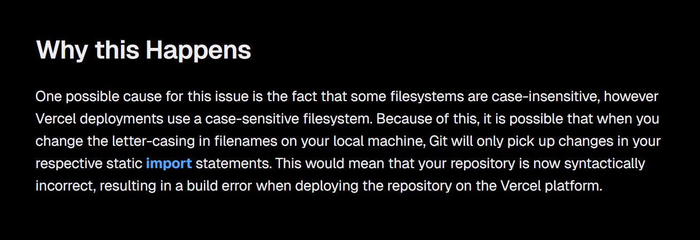

최근에 블로그 리팩토링을 좀 했는데 Vercel에서 빌드 에러가 났다.
import해오는 컴포넌트를 읽을 수 없다는 에러 메세지였다.
로컬에서 빌드 테스트 했을 때는 문제가 없었는데 왜그러니...

해결 방법을 구글링 하다가 원인을 찾아 해결했다.
문제는 git 요녀석이었다.

{/* prettier-ignore */}
<i>
  출처: <a href="https://vercel.com/guides/how-do-i-resolve-a-module-not-found-error" target="_blank" rel="noopener noreferrer">Vercel</a>
</i>

리팩토링 과정에서 폴더 구조와 이름을 변경했는데, 이게 문제가 됐다.
git 파일 시스템은 대소문자를 구분하지 않는데(case-insensitive) 반해, Vercel은 대소문자 구분을 해서(case-sensitive) 그렇단다.
git도 Linux/Unix 환경에서 개발되어서 처음에는 case-sensitive 방식을 따랐는데, Windows랑 MacOS 사용자도 많이 늘면서 이 친구들이 사용하는 case-insensitive 방식을 따르도록 조정되었다고...(참고로 Windows는 NTFS, masOS는 APFS와 이전 HFS+ 파일 시스템 방식이라고 함)

얘네들이 case-insensitive한 방식을 따르는 이유가 크로스 플랫폼 호환성 때문이라는 썰도 있고 사용자 편의성을 위해서라는 썰도 있는데 둘 다 말 되는 것 같다.
반면에 Linux/Unix 환경에서 case-sensitive한 방식을 사용하는 이유가 주 사용자가 프로그래머나 개발자였고 대소문자를 구분하는 게 더 세밀한 파일 관리와 제어가 가능하기 때문에라는(왠지 고개가 끄덕여지는...)

아무튼 요 문제는 git mv로 파일 위치를 변경해서 '얘 이름 바뀌었어요~'라고 git한테 알려주거나, 아니면 git config core.ignorecase false로 못 박던가 하면 된다.
