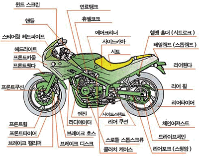

오늘 새삼 드는 생각은 전문 기술자가 되는 과정에 대한 거다.

여기 멋진 오토바이가 있다.
오토바이에 대해 잘 모르는 사람에게 오토바이는 뭘로 구성되어 있나요?라고 물으면 아마 이렇게 대답할 수 있을 거다.

'음... 바퀴랑... 프레임이랑... 엔진? 아! 운전대(?)도요'

그럼 조금 더 자세히 오토바이의 구성 요소를 보자.

{/* prettier-ignore */}
<i>
  출처: <a href="https://www.dlmotors.co.kr" target="_blank" rel="noopener noreferrer">www.dlmotors.co.kr</a>
</i>

뭐가 되게 많다. 거기다 이게 다가 아니다... 엔진만 해도 세부적으로 들어가기 시작하면 엄청 많은 지식들이 들어나기 시작한다.
추상화 수준이 높은 곳에서 낮은 곳으로 가게 되는 느낌적인 느낌.
오토바이에 대해서 전문가일수록 더 넓고 깊게 알게 된다.
반대로 추상화 수준을 확장할 수도 있다.
승용차, 승합차, 화물차, 특수차 등 '자동차'라는 범위로 더 넓게 확장시키는 것.
그리고 오토바이의 엔진과 바퀴에 대해 잘 아는 사람이라면 승용차든 화물차든 바퀴가 있고 엔진이 있으니(전기차 말고) 이에 대해 보다 쉽게 알 수 있다.

대학에서 컴퓨터 구조니 자료구조니 메모리니 알고리즘이니 공학수학이니 괜히 가르치는 게 아닐거다.
중요하면서 기본이 되는 것들이니 가르치겠지...
이쪽 분야에 전문 기술자가 될 생각이라면 이런 중요한 기본들을 잘 다져야겠다.
